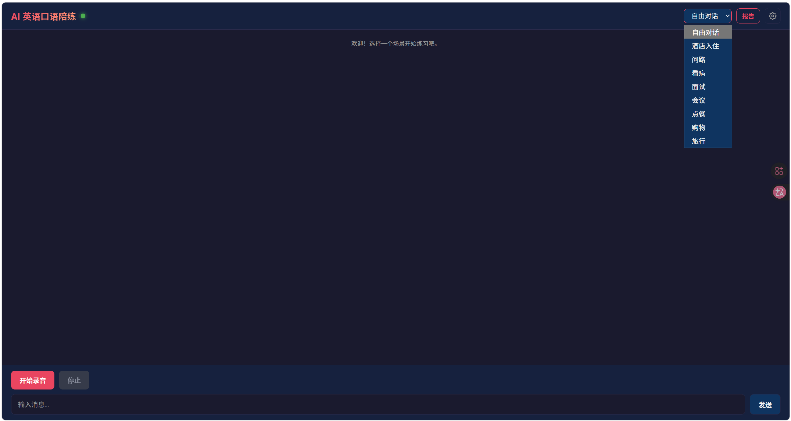

# AI English Speaking Coach / AI 英语口语陪练

> 打破"哑巴英语"——你的私人 AI 口语教练，随时随地开口说。

[](https://www.python.org/)
[](https://developer.nvidia.com/cuda-toolkit)
[](LICENSE)
[](https://fastapi.tiangolo.com/)
[](https://github.com/yourusername/ai-english-coach)

---

## 简介

**AI English Speaking Coach** 是一款基于大语言模型与本地 GPU 推理的英语口语陪练工具——不是背单词软件，也不是机械的跟读 App，而是一位能听懂你、回应你、纠正你、陪你进步的 AI 口语教练。

**目标用户**：英语学习者，尤其是那些"学了很多年，却不敢开口说"的人群。无论你是准备面试的求职者、即将出国旅行的游客，还是想提升商务英语能力的职场人，都可以在这里找到匹配的训练场景。

**核心价值**：项目将语音识别（ASR）、大模型对话引擎（LLM）、语音合成（TTS）三大模块深度整合，通过 WebSocket 实现端到端延迟 ≤ 2 秒的实时语音对话。系统内置 9 个真实场景、跟读练习、发音评测、语法纠错、课后报告等功能，所有语音处理在本地 GPU 上完成，前端采用零框架纯原生实现，部署门槛极低。

---

## 演示

### 视频演示

[](https://www.bilibili.com/video/BV1WCE46YEsV?t=47.0)

> 点击上方图片观看完整功能演示（B站）

### 界面截图



---

## 功能特性

| 序号 | 功能 | 说明 |
|:----:|------|------|
| 1 | **多场景沉浸式对话** | 内置面试、点餐、商务会议、旅行、自由对话等 9 个真实场景，每个场景有独立 AI 角色设定与对话风格 |
| 2 | **流式语音对话** | 基于 WebSocket 全双工通信，AI 回复逐字流式输出，边生成边朗读，自然流畅 |
| 3 | **智能打断机制** | 用户在 AI 说话时可随时插话打断，系统立即停止 TTS 播放并切换至聆听状态，打断响应 ≤ 500ms |
| 4 | **跟读练习** | 点击对话气泡上的 🎤 按钮，TTS 播放标准发音后用户跟读，系统即时评分反馈 |
| 5 | **发音评测** | 基于 Whisper 转写 + WER（词错误率）算法，输出综合分数、流利度、准确度及逐词发音分析 |
| 6 | **语法纠错** | 实时检测语法、词汇、风格三类错误，致命错误当场提示，轻微错误汇总至课后报告 |
| 7 | **课后学习报告** | 会话结束后自动生成多维度报告：综合评分、错误列表、词汇统计、改进建议 |
| 8 | **翻译辅助** | 点击"译"按钮即可查看 AI 回复的中文翻译，降低理解门槛 |
| 9 | **主题切换** | 支持暗色/亮色模式一键切换，适应不同光线环境 |
| 10 | **多语言 UI** | 界面支持中文/英文双语切换，照顾不同语言习惯的用户 |
| 11 | **零框架前端** | 前端纯原生 HTML/CSS/JS 实现，零依赖、加载快、易于定制 |

---

## 技术架构

### 技术栈

| 模块 | 技术 | 说明 |
|------|------|------|
| 语音识别 (ASR) | faster-whisper | 本地 GPU 推理（base/small 模型），支持整段转写 + 流式转写 |
| 语音活动检测 (VAD) | webrtcvad | 帧级语音检测，自动切分语音段落 |
| 音频采集 | PyAudio | 麦克风回调模式采集，Queue 缓冲队列 |
| 对话引擎 (LLM) | DeepSeek Chat API | 异步流式对话，SSE 兼容输出，支持异常重试 |
| 语音合成 (TTS) | edge-tts | 微软 Edge 免费 TTS 接口，支持多语音选择 |
| 后端框架 | FastAPI + WebSocket | 高性能异步 Web 框架，全双工实时通信 |
| GPU 加速 | CUDA 12.6 + cuDNN 9.x | PyTorch 后端推理加速 |
| 前端 | 原生 HTML/CSS/JS | Web Audio API 音频播放，零依赖单页应用 |

### 系统架构

```
                          ┌──────────────────────┐
                          │     浏览器前端          │
                          │  (HTML/CSS/JS 零框架)  │
                          │  · 场景选择             │
                          │  · 对话气泡 + 字幕      │
                          │  · 录音/打断按钮        │
                          │  · Web Audio API 播放   │
                          └──────────┬───────────┘
                                     │ WebSocket (全双工)
                                     │ {"type":"audio","data":"<base64>"}
                                     │ {"type":"interrupt"}
                                     │ {"type":"start_scene","scene":"..."}
                          ┌──────────▼───────────┐
                          │   FastAPI Web 服务     │
                          │   · server.py         │
                          │   · handler.py        │
                          │   WS /ws/chat         │
                          │   GET /api/scenes     │
                          │   GET /api/report/{id} │
                          └──────────┬───────────┘
                                     │
          ┌──────────────────────────┼──────────────────────────┐
          │                          │                          │
┌─────────▼─────────┐    ┌──────────▼──────────┐    ┌──────────▼──────────┐
│   ASR 模块 (asr/)  │    │  Coach 模块 (coach/) │    │   TTS 模块 (tts/)   │
│  · audio_capture   │    │  · scene_manager     │    │  · synthesizer      │
│  · vad (webrtcvad) │    │    (YAML 加载/热重载) │    │  · edge-tts 流式合成 │
│  · recognizer      │    │  · engine            │    │  · 多语音选择        │
│    (faster-whisper) │    │    (DeepSeek 流式SSE) │    └─────────────────────┘
│  GPU 推理           │    └──────────┬──────────┘
└────────────────────┘               │
                          ┌──────────▼──────────┐
                          │ Evaluation 模块      │
                          │  · grammar_checker   │
                          │    (语法/词汇/风格)    │
                          │  · pronunciation     │
                          │    (WER + 逐词分析)   │
                          │  · report            │
                          │    (课后多维度报告)    │
                          └─────────────────────┘

数据流: 用户说话 → 麦克风采集 → VAD 切句 → ASR 转写 → Coach 生成回复
        → TTS 合成语音 → 扬声器播放 → Evaluation 记录纠错 → 课后生成报告

打断流: 用户点击打断 → WebSocket interrupt → 停止 TTS 播放 → 清空音频队列
        → Coach 取消当前生成 → 切换至聆听状态
```

---

## 快速开始

### 环境要求

| 依赖 | 版本/要求 |
|------|-----------|
| Python | 3.11 |
| CUDA | 12.6（需 NVIDIA GPU） |
| cuDNN | 9.x |
| 操作系统 | Windows 10/11（推荐）或 Linux |
| 硬件 | 麦克风 + 扬声器/耳机 |
| GPU 显存 | ≥ 4 GB（faster-whisper base 模型） |

### 安装

```bash
# 1. 克隆仓库
git clone https://github.com/yourusername/ai-english-coach.git
cd ai-english-coach

# 2. 创建虚拟环境
python -m venv venv

# 3. 激活虚拟环境
# Windows:
venv\Scripts\activate
# Linux/macOS:
source venv/bin/activate

# 4. 安装依赖
pip install -r requirements.txt
```

### 配置

复制模板并填入你的 API Key：

```bash
cp .env.example .env
```

然后编辑 `.env`，将 `your_api_key_here` 替换为你的 DeepSeek API Key（免费注册：https://platform.deepseek.com）。

### 启动

```bash
python main.py
```

浏览器自动打开 `http://localhost:8000`，选择场景即可开始对话。

---

## 使用说明

### 场景切换

进入页面后，左侧或顶部显示场景列表（面试、点餐、商务会议、旅行、自由对话等 9 个场景）。点击任一场景卡片即可切换，AI 角色设定与对话风格会随之改变。

### 语音对话

1. 点击麦克风按钮开始录音
2. 用英语自然说话，说完后松开按钮（或系统自动检测静音结束）
3. AI 识别语音后实时转写显示，同时开始流式生成回复
4. AI 回复文本逐字显示，并同步合成语音播放
5. 对话历史以气泡形式呈现，支持滚动查看

### 打断 AI

当 AI 正在说话时，点击打断按钮或直接开始说话：

- 系统立即停止当前 TTS 播放
- 中断 AI 的文本生成
- 切换为聆听状态，等待用户新输入
- 整个打断响应时间 ≤ 500ms

### 跟读练习

1. 在对话气泡中找到带 🎤 图标的消息
2. 点击 🎤 按钮，系统播放该句的标准 TTS 发音
3. 听完后跟读，系统录制你的语音
4. 实时显示发音评分（百分制）和 WER 指标
5. 逐词高亮标注发音准确/不准确的单词

### 发音评测

发音评测采用 Whisper 转写 + WER（词错误率）双指标：

- **综合分数**：0-100 分，基于 WER 映射
- **流利度**：语速、停顿自然度综合评估
- **准确度**：逐词发音与标准音对比
- **逐词详情**：绿色（准确）/ 黄色（可接受）/ 红色（需改进）

### 翻译功能

点击任意 AI 回复气泡右侧的"译"按钮，立即显示该句的中文翻译。再次点击可隐藏翻译，保持界面清爽。

### 课后报告

结束对话会话后，系统自动生成学习报告：

- **综合评分**：整体表现百分制分数
- **统计数据**：对话轮数、总词数、新词汇
- **错误列表**：语法错误、发音失误汇总
- **改进建议**：基于本次表现的个性化建议

报告页面可通过浏览器查看，支持导出或打印。

### 设置面板

点击界面右上角齿轮图标打开设置面板：

- **主题切换**：暗色模式 / 亮色模式，即时生效
- **语言切换**：中文界面 / English UI，无需刷新页面

---

## 项目结构

```
MyDemo/
├── main.py                    # 应用入口，启动 FastAPI 服务
├── config.py                  # 全局配置管理（.env 加载 + 默认值）
├── requirements.txt           # Python 依赖清单
├── .env                       # 环境变量（API Key 等敏感配置，不纳入版本控制）
│
├── asr/                       # 语音识别模块
│   ├── __init__.py            # 模块导出（WhisperRecognizer, AudioCapture, VAD）
│   ├── recognizer.py          # faster-whisper 识别封装（GPU 推理，整段/流式转写）
│   ├── audio_capture.py       # 麦克风音频采集（PyAudio 回调 + Queue 缓冲）
│   ├── vad.py                 # 语音活动检测（webrtcvad 帧级检测 + 段落切分）
│   └── tests/                 # ASR 单元测试（VAD/音频采集/识别器）
│
├── tts/                       # 语音合成模块
│   ├── __init__.py            # 模块导出（Synthesizer, text_to_speech）
│   ├── synthesizer.py         # edge-tts 合成封装（文件合成 + 流式合成 + 语音列表）
│   └── tests/                 # TTS 单元测试
│
├── coach/                     # 对话引擎模块
│   ├── __init__.py            # 模块导出（CoachEngine, SceneManager）
│   ├── engine.py              # DeepSeek API 异步对话引擎（流式 SSE + 异常重试）
│   ├── scene_manager.py       # 场景管理（YAML 加载/切换/热重载）
│   └── tests/                 # Coach 单元测试（24 个，场景/历史管理/消息构建）
│
├── evaluation/                # 评测模块
│   ├── __init__.py            # 模块导出（GrammarChecker, PronunciationEvaluator）
│   ├── grammar_checker.py     # 语法纠错（语法/词汇/风格三维度，结构化 JSON 输出）
│   ├── pronunciation.py       # 发音评测（Whisper 转写 + WER 文本相似度）
│   ├── report.py              # 课后报告生成（多维度评分 + 错误汇总 + 建议）
│   └── tests/                 # Evaluation 单元测试（27 个，含边界情况覆盖）
│
├── web/                       # Web 服务模块
│   ├── server.py              # FastAPI 应用 + WebSocket 端点（/ws/chat）
│   └── handler.py             # 消息处理与模块调度（路由 ASR/Coach/TTS/Evaluation）
│
├── frontend/                  # 前端界面（零框架）
│   └── index.html             # 单页应用（HTML/CSS/JS + Web Audio API）
│
├── scenes/                    # 场景 Prompt 模板（YAML 格式）
│   ├── interview.yaml         # 面试场景（面试官角色，正式风格）
│   ├── ordering.yaml          # 点餐场景（服务员角色，日常风格）
│   ├── meeting.yaml           # 商务会议场景（主持人角色，商务风格）
│   ├── free_talk.yaml         # 自由对话场景（朋友角色，随意风格）
│   └── travel.yaml            # 旅行场景（旅伴角色，实用风格）
│
└── docs/                      # 项目文档
    ├── requirements.md        # 需求文档（功能需求 + 非功能需求 + 验收标准）
    ├── design.md              # 设计文档（系统架构 + 模块设计 + 数据流 + 消息协议）
    ├── project_plan.md        # 项目计划（阶段控制 P0-P7）
    └── demo_script.md         # 演示视频脚本
```

---

## 开发历程

| 阶段 | 名称 | 功能 | 核心实现 |
|:----:|------|------|------|
| P0 | 项目初始化 | 文档体系 + 项目骨架 + 环境配置 | requirements.md / design.md / project_plan.md；所有模块 `__init__.py` 就位；`config.py` 加载 API Key |
| P1 | 对话引擎 | DeepSeek 集成 + 场景 Prompt | `coach/engine.py`（流式 SSE 异步对话引擎）；`coach/scene_manager.py`（YAML 场景热重载）；5 个 YAML 场景模板；24 个单元测试 |
| P2 | 语音识别 | Whisper 接入 + 音频采集 + VAD | `asr/recognizer.py`（faster-whisper GPU 推理）；`asr/audio_capture.py`（PyAudio 回调采集）；`asr/vad.py`（webrtcvad 切句）；识别准确率 ≥ 90% |
| P3 | 语音合成 | edge-tts 接入 + 音频播放 | `tts/synthesizer.py`（文件合成 + 流式合成）；合成延迟 ≤ 1s；多语音可选 |
| P4 | 服务串联 | FastAPI + WebSocket + 前端 | `web/server.py`（WS /ws/chat）；`web/handler.py`（消息路由）；`frontend/index.html` 对话界面 |
| P5 | 纠错评测 | 语法纠错 + 发音评测 | `evaluation/grammar_checker.py`（三维度检测）；`evaluation/pronunciation.py`（WER 评测）；27 个单元测试；API 不可用时优雅降级 |
| P6 | 课后报告 | 总结报告生成 + 展示 | `evaluation/report.py`（多维度评分 + 错误汇总 + 改进建议）；前端报告展示页 |
| P7 | 打磨上线 | 延迟优化 + 打断机制 + 测试 | 打断机制（WebSocket interrupt → 停止 TTS + 取消生成）；端到端延迟 ≤ 2s；打断响应 ≤ 500ms |

---

## 许可证

本项目采用 [MIT License](LICENSE) 开源。

```
MIT License

Copyright (c) 2025 AI English Speaking Coach

Permission is hereby granted, free of charge, to any person obtaining a copy
of this software and associated documentation files...
```
